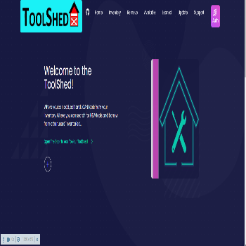

# Tool Shed
[Heroku Deployed Link](https://toolshed-app-team8.herokuapp.com/)

## Table of contents
- [Description](#Description)
- [Installation](#Installation)
- [Usage](#Usage)
- [Screenshots](#Screenshots)
- [Contributors](#Contributors)
- [Repository Link](#Repositories)

## Description 
A digital tool shed to store, lend, categorize, and structure data about your most necessary tools. The `Tool Shed` app uses both the frontend and the backend to manage obtained tools and the ones needed. There are multiple ways to utilize this app. The storing of the tools is one. A laborer could use this personally to keep track of all the tools bought. There will be an option to save the tools wanted, such as a wish list. These tools will be organized based on categories that fits that particular tool best. Lastly, the ability to lend tools to your most trusted (or mistrusted) comrade is no longer a problem. This app grants the user the ability to track who and when the tool was lend out. No more forgetting what happen to your tools with this app made by `The Number 8`.

## Installation
1. IN MYSQL

DROP DATABASE IF EXISTS toolshed;
CREATE DATABASE toolshed;
USE toolshed;

2. node server.js - intialize the seqluelize process - sets up tables / fields. 
3. Stop server 
4. npm run seed --- populates the database.
5. node server.js OR npm start 

#### NPM install the following

## Usage
Use this app to organize, lend tools and more...

## Screenshots

## Contributors
[Shalom Dawit](https://github.com/MrDawit)
 

[Danielli Franquim](https://github.com/Elli360)
 

[Troy Lochner](https://github.com/troylochner)
 

[Luis Calderin](https://github.com/lcalderin12)

## Repositories
- [Heroku Deployed Link](https://toolshed-app-team8.herokuapp.com/)
- [Project Repo](https://github.com/Elli360/Project3)
